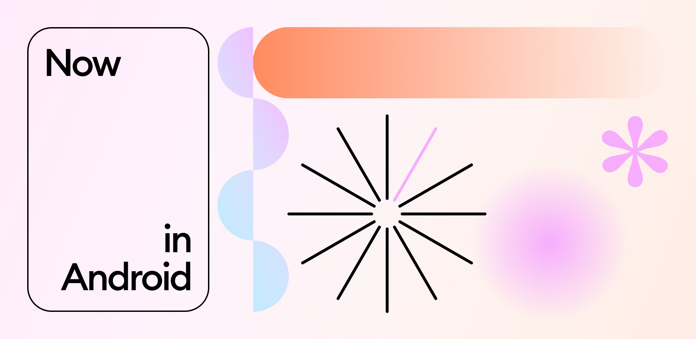
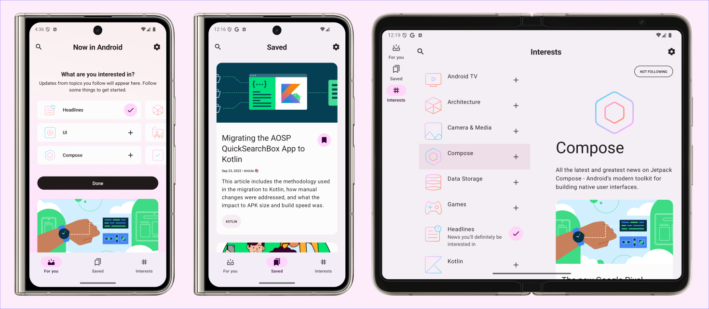

<a href="https://play.google.com/store/apps/details?id=com.google.samples.apps.nowinandroid"></a>

Now in Android 应用
==================

**通过[设计案例分析](https://goo.gle/nia-figma)、[架构学习之旅](docs/ArchitectureLearningJourney.md)和[模块化学习之旅](docs/ModularizationLearningJourney.md)了解此应用的设计与构建过程。**

这是 [Now in Android](https://developer.android.com/series/now-in-android)
应用的代码仓库。目前仍在 **开发中** 🚧。

**Now in Android** 是一款完全使用 Kotlin 和 Jetpack Compose 构建的功能齐全的 Android 应用。它遵循 Android 设计和开发的最佳实践，旨在为开发者提供有价值的参考。作为一款运行中的应用，它帮助开发者通过定期提供新闻更新来了解 Android 开发的最新动态。

该应用目前正在开发中。`prodRelease` 变体已[在 Play Store 上架](https://play.google.com/store/apps/details?id=com.google.samples.apps.nowinandroid)。

# 功能特性

**Now in Android** 展示来自
[Now in Android](https://developer.android.com/series/now-in-android) 系列的内容。用户可以浏览最近视频、文章和其他内容的链接。用户还可以关注自己感兴趣的主题，并在匹配其关注兴趣的新内容发布时收到通知。

## 截图



# 开发环境

**Now in Android** 使用 Gradle 构建系统，可直接导入 Android Studio（请确保使用最新稳定版，可在[此处](https://developer.android.com/studio)获取）。

将运行配置改为 `app`。


`demoDebug` 和 `demoRelease` 构建变体可以构建和运行（`prod` 变体使用了后端服务，目前该后端未公开发布）。


启动运行后，你可以参考以下学习之旅，深入了解使用了哪些库和工具、UI、测试、架构等方面的设计思路，以及这些不同部分如何组合在一起构成一个完整的应用。

# 架构

**Now in Android** 应用遵循
[官方架构指南](https://developer.android.com/topic/architecture)，
详情见[架构学习之旅](docs/ArchitectureLearningJourney.md)。

# 模块化

**Now in Android** 应用已完全模块化，详细的指导和模块化策略说明见
[模块化学习之旅](docs/ModularizationLearningJourney.md)。

# 构建

应用包含常用的 `debug` 和 `release` 构建类型。

此外，`app` 的 `benchmark` 变体用于测试启动性能并生成基线配置文件（详见下文）。

`app-nia-catalog` 是一个独立应用，展示 **Now in Android** 风格化的组件列表。

该应用还使用
[产品风味](https://developer.android.com/studio/build/build-variants#product-flavors)来控制应用内容的加载来源。

`demo` 风味使用本地静态数据，可以立即构建和探索 UI。

`prod` 风味对后端服务器进行真实的网络调用以提供最新内容。目前没有公开的后端可用。

日常开发使用 `demoDebug` 变体。UI 性能测试使用 `demoRelease` 变体。

# 测试

为了方便组件测试，**Now in Android** 使用 [Hilt](https://developer.android.com/training/dependency-injection/hilt-android) 进行依赖注入。

大多数数据层组件以接口形式定义。然后，具体的实现（具有各种依赖）被绑定以向应用中的其他组件提供这些接口。在测试中，**Now in Android** 明确**不**使用任何 Mock 框架。相反，可以使用 Hilt 的测试 API（或通过 ViewModel 测试的手动构造函数注入）将生产实现替换为测试替身。

这些测试替身实现了与生产实现相同的接口，并且通常提供简化（但仍然真实）的实现以及额外的测试钩子。这使得测试更加健壮，能覆盖更多的生产代码，而不仅仅是验证对 Mock 的特定调用。

示例：
- 在插桩测试中，使用临时文件夹存储用户偏好设置，每次测试后清空。这允许使用真实的 `DataStore` 并测试所有相关代码，而不是 Mock 数据更新的流程。

- 每个仓库都有 `Test` 实现，它们实现了正常的完整仓库接口，同时也提供了专用于测试的钩子。ViewModel 测试使用这些 `Test` 仓库，因此可以利用测试专用钩子来操纵 `Test` 仓库的状态并验证结果行为，而不是检查特定的仓库方法是否被调用。

执行以下 Gradle 任务来运行测试：

- `testDemoDebug` 对 `demoDebug` 变体运行所有本地测试。截图测试会失败（原因见下文）。为避免此问题，在运行单元测试前先执行 `recordRoborazziDemoDebug`。
- `connectedDemoDebugAndroidTest` 对 `demoDebug` 变体运行所有插桩测试。

> [!NOTE]
> 请勿运行 `./gradlew test` 或 `./gradlew connectedAndroidTest`，因为这会针对_所有_构建变体执行测试，这不仅不必要，而且会失败，因为只有 `demoDebug` 变体受支持。其他变体没有任何测试（虽然未来可能会改变）。

## 截图测试
截图测试对应用内的屏幕或 UI 组件进行截图，并将其与之前录制的已知正确截图进行对比。

例如，Now in Android 有[截图测试](https://github.com/android/nowinandroid/blob/main/app/src/testDemo/kotlin/com/google/samples/apps/nowinandroid/ui/NiaAppScreenSizesScreenshotTests.kt)来验证导航在不同屏幕尺寸下是否正确显示（[已知正确的截图](https://github.com/android/nowinandroid/tree/main/app/src/testDemo/screenshots)）。

Now In Android 使用 [Roborazzi](https://github.com/takahirom/roborazzi) 对某些屏幕和 UI 组件进行截图测试。使用截图测试时，以下 Gradle 任务非常有用：

- `verifyRoborazziDemoDebug` 运行所有截图测试，将截图与已知正确的截图进行对比验证。
- `recordRoborazziDemoDebug` 录制新的"已知正确"截图。当你对 UI 进行了更改并手动确认渲染正确后使用此命令。截图将存储在 `modulename/src/test/screenshots`。
- `compareRoborazziDemoDebug` 创建失败测试与已知正确图像之间的对比图像。这些也可以在 `modulename/src/test/screenshots` 中找到。

> [!NOTE]
> **关于截图测试失败的注意事项**
> 此仓库中存储的已知正确截图是在 Linux 上通过 CI 录制的。其他平台可能（并且很可能会）生成略有不同的图像，导致截图测试失败。在非 Linux 平台上工作时，一个解决办法是在开始工作前先在 `main` 分支上运行 `recordRoborazziDemoDebug`。进行更改后，`verifyRoborazziDemoDebug` 将只会识别出真正的差异。

有关截图测试的更多信息，请[查看此演讲](https://www.droidcon.com/2023/11/15/easy-screenshot-testing-with-compose/)。

# UI
该应用使用 [Material 3 指南](https://m3.material.io/)进行设计。在 [Now in Android Material 3 案例分析](https://goo.gle/nia-figma)中了解更多设计过程并获取设计文件（设计资源[也可作为 PDF 获取](docs/Now-In-Android-Design-File.pdf)）。

屏幕和 UI 元素完全使用 [Jetpack Compose](https://developer.android.com/jetpack/compose) 构建。

该应用有两个主题：

- 动态颜色 - 使用基于[用户当前颜色主题](https://material.io/blog/announcing-material-you)的颜色（如果支持）
- 默认主题 - 当不支持动态颜色时使用预定义颜色

每个主题也都支持深色模式。

该应用使用自适应布局来[支持不同的屏幕尺寸](https://developer.android.com/guide/topics/large-screens/support-different-screen-sizes)。

在[此处](docs/ArchitectureLearningJourney.md#ui-layer)了解更多关于 UI 架构的信息。

# 性能

## 基准测试

在 `benchmarks` 模块中查找所有使用 [`Macrobenchmark`](https://developer.android.com/topic/performance/benchmarking/macrobenchmark-overview) 编写的测试。此模块还包含生成基线配置文件的测试。

## 基线配置文件

此应用的基线配置文件位于 [`app/src/main/baseline-prof.txt`](app/src/main/baseline-prof.txt)。它包含启用应用启动关键用户路径 AOT 编译的规则。有关基线配置文件的更多信息，请阅读[此文档](https://developer.android.com/studio/profile/baselineprofiles)。

> [!NOTE]
> 基线配置文件需要在触及更改应用启动代码的 Release 构建时重新生成。

要生成基线配置文件，选择 `benchmark` 构建变体，在 AOSP Android 模拟器上运行 `BaselineProfileGenerator` 基准测试。然后将生成的基线配置文件从模拟器复制到 [`app/src/main/baseline-prof.txt`](app/src/main/baseline-prof.txt)。

## Compose 编译器指标

运行以下命令获取和分析 Compose 编译器指标：

```bash
./gradlew assembleRelease -PenableComposeCompilerMetrics=true -PenableComposeCompilerReports=true
```

报告文件将添加到 [build/compose-reports](build/compose-reports)。指标文件也将添加到 [build/compose-metrics](build/compose-metrics)。

有关 Compose 编译器指标的更多信息，请参阅[此博客文章](https://medium.com/androiddevelopers/jetpack-compose-stability-explained-79c10db270c8)。

# 许可证

**Now in Android** 按照 Apache License（版本 2.0）的条款分发。详情请参阅[许可证](LICENSE)。
