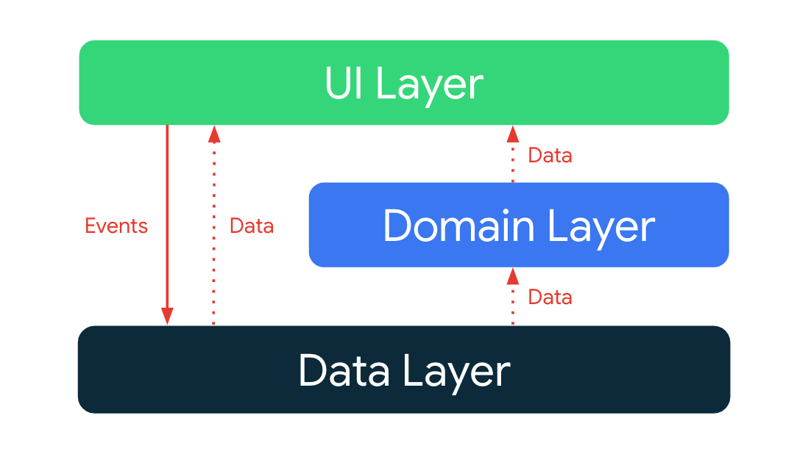
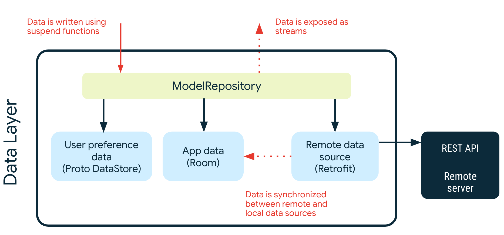
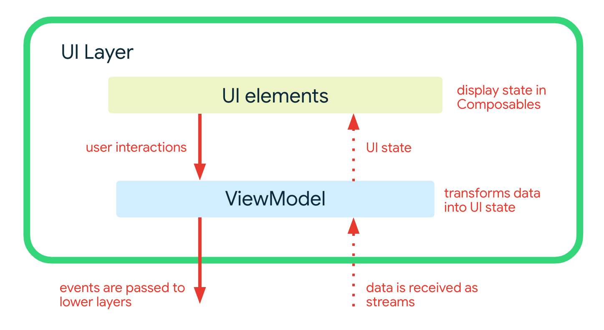

# 架构学习之旅

在此学习之旅中，你将了解 Now in Android 应用的架构：它的分层、关键类以及它们之间的交互。

## 目标与需求

应用架构的目标是：

*   尽可能紧密地遵循[官方架构指南](https://developer.android.com/jetpack/guide)。
*   开发者易于理解，不过于实验性。
*   支持多个开发者在同一代码库上工作。
*   方便本地和插桩测试，无论是在开发者机器上还是使用持续集成（CI）。
*   最小化构建时间。

## 架构概述

应用架构有三个层次：[数据层](https://developer.android.com/jetpack/guide/data-layer)、[领域层](https://developer.android.com/jetpack/guide/domain-layer)和 [UI 层](https://developer.android.com/jetpack/guide/ui-layer)。

> [!NOTE]
> 官方 Android 架构与其他架构（如"Clean Architecture"）有所不同。其他架构的概念可能在此处不适用，或以不同的方式应用。[更多讨论见此](https://github.com/android/nowinandroid/discussions/1273)。

该架构遵循响应式编程模型，采用[单向数据流](https://developer.android.com/jetpack/guide/ui-layer#udf)。以数据层为底层，关键概念是：

*   上层对下层的更改做出响应。
*   事件向下流动。
*   数据向上流动。

数据流使用流（Stream）实现，通过 [Kotlin Flows](https://developer.android.com/kotlin/flow) 实现。

### 示例：在"为你推荐"页面上显示新闻

当应用首次运行时，它将尝试从远程服务器加载新闻资源列表（当选择 `prod` 构建风味时，`demo` 构建将使用本地数据）。加载后，这些内容将根据用户选择的兴趣显示。

以下图示展示了发生的事件以及数据如何从相关对象流动以实现这一点。

以下是每个步骤的具体情况。查找相关代码的最简单方法是将项目加载到 Android Studio 中，然后搜索"Code"列中的文本（便捷快捷键：双击 <kbd>⇧ SHIFT</kbd>）。

<table>
  <tr>
   <td><strong>步骤</strong>
   </td>
   <td><strong>描述</strong>
   </td>
   <td><strong>代码</strong>
   </td>
  </tr>
  <tr>
   <td>1
   </td>
   <td>应用启动时，一个同步所有仓库的 <a href="https://developer.android.com/topic/libraries/architecture/workmanager">WorkManager</a> 任务被入队。
   </td>
   <td><code>Sync.initialize</code>
   </td>
  </tr>
  <tr>
   <td>2
   </td>
   <td><code>ForYouViewModel</code> 调用 <code>GetUserNewsResourcesUseCase</code> 来获取带有收藏/保存状态的新闻资源流。在用户仓库和新闻仓库都发出数据之前，此流不会发出任何元素。等待期间，Feed 状态被设置为 <code>Loading</code>。
   </td>
   <td>搜索 <code>NewsFeedUiState.Loading</code> 的使用
   </td>
  </tr>
  <tr>
   <td>3
   </td>
   <td>用户数据仓库从基于 Proto DataStore 的本地数据源获取 <code>UserData</code> 对象流。
   </td>
   <td><code>NiaPreferencesDataSource.userData</code>
   </td>
  </tr>
  <tr>
   <td>4
   </td>
   <td>WorkManager 执行同步任务，调用 <code>OfflineFirstNewsRepository</code> 开始与远程数据源同步数据。
   </td>
   <td><code>SyncWorker.doWork</code>
   </td>
  </tr>
  <tr>
   <td>5
   </td>
   <td><code>OfflineFirstNewsRepository</code> 调用 <code>RetrofitNiaNetwork</code>，通过 <a href="https://square.github.io/retrofit/">Retrofit</a> 执行实际的 API 请求。
   </td>
   <td><code>OfflineFirstNewsRepository.syncWith</code>
   </td>
  </tr>
  <tr>
   <td>6
   </td>
   <td><code>RetrofitNiaNetwork</code> 调用远程服务器上的 REST API。
   </td>
   <td><code>RetrofitNiaNetwork.getNewsResources</code>
   </td>
  </tr>
  <tr>
   <td>7
   </td>
   <td><code>RetrofitNiaNetwork</code> 接收来自远程服务器的网络响应。
   </td>
   <td><code>RetrofitNiaNetwork.getNewsResources</code>
   </td>
  </tr>
  <tr>
   <td>8
   </td>
   <td><code>OfflineFirstNewsRepository</code> 通过向本地 <a href="https://developer.android.com/training/data-storage/room">Room 数据库</a>插入、更新或删除数据，将远程数据与 <code>NewsResourceDao</code> 同步。
   </td>
   <td><code>OfflineFirstNewsRepository.syncWith</code>
   </td>
  </tr>
  <tr>
   <td>9
   </td>
   <td>当 <code>NewsResourceDao</code> 中的数据发生变化时，它会被发送到新闻资源数据流（这是一个 <a href="https://developer.android.com/kotlin/flow">Flow</a>）中。
   </td>
   <td><code>NewsResourceDao.getNewsResources</code>
   </td>
  </tr>
  <tr>
   <td>10
   </td>
   <td><code>OfflineFirstNewsRepository</code> 作为此流的<a href="https://developer.android.com/kotlin/flow#modify">中间操作符</a>，将传入的 <code>PopulatedNewsResource</code>（数据库模型，数据层内部使用）转换为公共的 <code>NewsResource</code> 模型，供其他层使用。
   </td>
   <td><code>OfflineFirstNewsRepository.getNewsResources</code>
   </td>
  </tr>
  <tr>
   <td>11
   </td>
   <td><code>GetUserNewsResourcesUseCase</code> 将新闻资源列表与用户数据组合，发出 <code>UserNewsResource</code> 列表。
   </td>
   <td><code>GetUserNewsResourcesUseCase.invoke</code>
   </td>
  </tr>
  <tr>
   <td>12
   </td>
   <td>当 <code>ForYouViewModel</code> 接收到可收藏的新闻资源时，它会将 Feed 状态更新为 <code>Success</code>。

  <code>ForYouScreen</code> 然后使用状态中的可收藏新闻资源来渲染屏幕。
   </td>
   <td>搜索 <code>NewsFeedUiState.Success</code> 的实例
   </td>
  </tr>
</table>

## 数据层

数据层实现为离线优先的应用数据和业务逻辑来源。它是应用中所有数据的真实来源。

每个仓库都有自己的模型。例如，`TopicsRepository` 有 `Topic` 模型，`NewsRepository` 有 `NewsResource` 模型。

仓库是其他层的公共 API，它们提供访问应用数据的_唯一_途径。仓库通常提供一个或多个读取和写入数据的方法。

### 读取数据

数据以数据流的形式暴露。这意味着仓库的每个客户端必须准备好对数据变化做出响应。数据不以快照形式暴露（例如 `getModel`），因为无法保证在使用时它仍然有效。

读取从本地存储作为真实来源执行，因此从 `Repository` 实例读取时不会有错误。然而，在尝试将本地存储中的数据与远程源进行协调时可能会发生错误。关于错误协调的更多信息，请查看下面的数据同步部分。

_示例：读取主题列表_

可以通过订阅 `TopicsRepository::getTopics` 流来获取主题列表，该流发出 `List<Topic>`。

每当主题列表发生变化（例如添加新主题时），更新后的 `List<Topic>` 就会被发送到流中。

### 写入数据

为了写入数据，仓库提供挂起函数。调用方需要确保其执行有适当的作用域。

_示例：关注一个主题_

只需调用 `UserDataRepository.toggleFollowedTopicId`，传入用户希望关注的主题 ID 和 `followed=true` 表示应关注该主题（使用 `false` 取消关注）。

### 数据源

一个仓库可能依赖一个或多个数据源。例如，`OfflineFirstTopicsRepository` 依赖以下数据源：

<table>
  <tr>
   <td><strong>名称</strong>
   </td>
   <td><strong>底层存储</strong>
   </td>
   <td><strong>用途</strong>
   </td>
  </tr>
  <tr>
   <td>TopicsDao
   </td>
   <td><a href="https://developer.android.com/training/data-storage/room">Room/SQLite</a>
   </td>
   <td>与主题相关的持久化关系数据
   </td>
  </tr>
  <tr>
   <td>NiaPreferencesDataSource
   </td>
   <td><a href="https://developer.android.com/topic/libraries/architecture/datastore">Proto DataStore</a>
   </td>
   <td>与用户偏好相关的持久化非结构化数据，特别是用户感兴趣的主题。这在 .proto 文件中使用 protobuf 语法定义和建模。
   </td>
  </tr>
  <tr>
   <td>NiaNetworkDataSource
   </td>
   <td>使用 Retrofit 访问的远程 API
   </td>
   <td>通过 REST API 端点以 JSON 格式提供的主题数据。
   </td>
  </tr>
</table>

### 数据同步

仓库负责协调本地存储中的数据与远程源。一旦从远程数据源获取数据，它会立即写入本地存储。更新后的数据从本地存储（Room）发送到相关数据流中，并由任何正在监听的客户端接收。

这种方法确保应用的读取和写入关注点是分离的，不会相互干扰。

在数据同步过程中发生错误时，采用指数退避策略。这通过 `SyncWorker`（`Synchronizer` 接口的实现）委托给 `WorkManager` 处理。

参见 `OfflineFirstNewsRepository.syncWith` 了解数据同步的示例。

## 领域层
[领域层](https://developer.android.com/topic/architecture/domain-layer)包含用例。这些是具有单一可调用方法（`operator fun invoke`）的类，包含业务逻辑。

这些用例用于简化 ViewModel 并从中移除重复逻辑。它们通常组合和转换来自仓库的数据。

例如，`GetUserNewsResourcesUseCase` 将来自 `NewsRepository` 的 `NewsResource` 流（使用 `Flow` 实现）与来自 `UserDataRepository` 的 `UserData` 对象流组合，创建 `UserNewsResource` 流。此流被各种 ViewModel 用于在屏幕上显示带有收藏状态的新闻资源。

值得注意的是，Now in Android 中的领域层目前_不包含_任何用于事件处理的用例。事件由 UI 层直接调用仓库的方法来处理。

## UI 层

[UI 层](https://developer.android.com/topic/architecture/ui-layer)包括：

*   使用 [Jetpack Compose](https://developer.android.com/jetpack/compose) 构建的 UI 元素
*   [Android ViewModels](https://developer.android.com/topic/libraries/architecture/viewmodel)

ViewModel 从用例和仓库接收数据流，并将其转换为 UI 状态。UI 元素反映此状态，并为用户提供与应用交互的方式。这些交互作为事件传递给 ViewModel 进行处理。

### UI 状态建模

UI 状态使用密封层次结构（接口和不可变数据类）进行建模。状态对象仅通过数据流的转换来发出。这种方法确保：

*   UI 状态始终代表底层应用数据——应用数据是真实来源。
*   UI 元素处理所有可能的状态。

**示例："为你推荐"页面上的新闻 Feed**

"为你推荐"页面上的新闻资源 Feed（列表）使用 `NewsFeedUiState` 建模。这是一个密封接口，创建了两种可能状态的层次结构：

*   `Loading` 表示数据正在加载中
*   `Success` 表示数据已成功加载。Success 状态包含新闻资源列表。

`feedState` 被传递给 `ForYouScreen` 可组合函数，该函数处理这两种状态。

### 将流转换为 UI 状态

ViewModel 从一个或多个用例或仓库接收数据流作为冷 [flows](https://kotlin.github.io/kotlinx.coroutines/kotlinx-coroutines-core/kotlinx.coroutines.flow/-flow/index.html)。这些流被[组合](https://kotlin.github.io/kotlinx.coroutines/kotlinx-coroutines-core/kotlinx.coroutines.flow/combine.html)在一起，或者简单地[映射](https://kotlinlang.org/api/kotlinx.coroutines/kotlinx-coroutines-core/kotlinx.coroutines.flow/map.html)，以生成单一 UI 状态流。然后使用 [stateIn](https://kotlin.github.io/kotlinx.coroutines/kotlinx-coroutines-core/kotlinx.coroutines.flow/state-in.html) 将此单一流转换为热流。转换为状态流使 UI 元素能够从流中读取最后已知的状态。

**示例：显示已关注的主题**

`InterestsViewModel` 将 `uiState` 暴露为 `StateFlow<InterestsUiState>`。这个热流是通过获取 `GetFollowableTopicsUseCase` 提供的 `List<FollowableTopic>` 冷流来创建的。每次发出新列表时，它都被转换为 `InterestsUiState.Interests` 状态，然后暴露给 UI。

### 处理用户交互

用户操作通过常规方法调用从 UI 元素传递给 ViewModel。这些方法以 Lambda 表达式的形式传递给 UI 元素。

**示例：关注一个主题**

`InterestsScreen` 接受一个名为 `followTopic` 的 Lambda 表达式，该表达式由 `InterestsViewModel.followTopic` 提供。每当用户点击一个主题进行关注时，此方法被调用。ViewModel 随后通过通知用户数据仓库来处理此操作。

## 延伸阅读

[应用架构指南](https://developer.android.com/topic/architecture)

[Jetpack Compose](https://developer.android.com/jetpack/compose)
