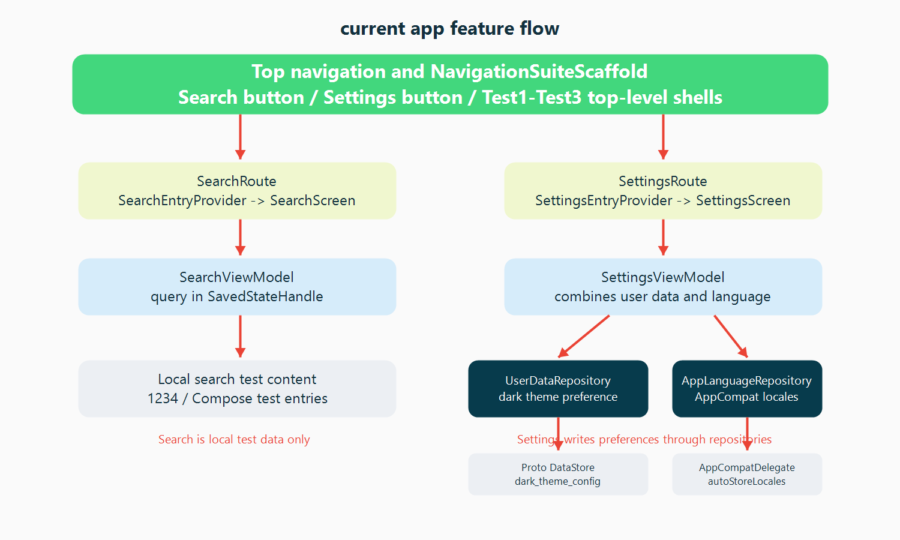

# 架构学习之旅

本文记录 nowtest 当前的架构状态。项目是单 Activity、多模块、Jetpack Compose 原生 Android 应用，当前重点维护应用壳、Navigation 3 类型安全导航、搜索、设置、Jasmine 设计系统、数据基础设施和测试基础设施。

## 当前整体架构


当前主链路：

```text
NtApplication
  -> MainActivity
  -> NtTheme
  -> NtApp
  -> NavigationSuiteScaffold
  -> NavDisplay
  -> route/*/scene
```

主要分层：

- UI 层：`app` 应用壳、`route/*/scene` 页面、Compose、Material 3、Navigation 3。
- 状态层：`ViewModel`、`UiState`、`SavedStateHandle`、Kotlin `Flow`。
- 数据层：`core:data` 仓库接口和实现，统一连接 DataStore、Room、Network、系统状态监控。
- 基础设施层：Hilt/KSP、DataStore、Room、Retrofit/OkHttp、Jasmine 主题、Roborazzi、测试替身、Gradle convention plugins。

## 当前功能流



当前有效页面：

- 顶层页面：`Test1Route`、`Test2Route`、`Test3Route`。这三个页面保留为导航页面壳。
- 独立页面：`SearchRoute`、`SettingsRoute`。它们从顶部导航栏进入，由 `Navigator` 放入当前顶层栈的子栈。

搜索链路：

```text
Top navigation Search button
  -> SearchRoute
  -> SearchEntryProvider
  -> SearchScreen
  -> SearchViewModel
  -> SearchTestContent.localSearchTestContents
```

设置链路：

```text
Top navigation Settings button
  -> SettingsRoute
  -> SettingsEntryProvider
  -> SettingsScreen
  -> SettingsViewModel
  -> UserDataRepository / AppLanguageRepository
```

## 数据层边界


当前数据能力：

- `UserDataRepository`：向 UI 暴露 `UserData`，并写入深色模式偏好。
- `OfflineFirstUserDataRepository`：当前连接 `NtPreferencesDataSource`，并记录设置变更埋点。
- `NtPreferencesDataSource`：基于 Proto DataStore 保存 `dark_theme_config`。
- `NtDatabase`：Room 数据库组件，当前保留 `database_metadata` 表保证数据库组件有效。
- `NtNetworkDataSource`：网络数据源抽象，demo/prod flavor 分别提供实现，当前不承载页面搜索或内容同步。
- `NetworkMonitor`、`TimeZoneMonitor`：系统状态基础设施，由 `app` 和共享 UI 能力使用。

数据层规则：

- UI 不直接访问 DataStore、Room 或 Network。
- 页面需要数据时先走 repository。
- DataStore、Room、Network、Repository 模式本身是基础设施。
- 基础设施内部的业务字段、表、DTO、接口方法和测试数据按当前功能是否使用来维护。

## UI 层状态流


UI 层采用单向数据流：

```text
User interaction
  -> Screen callback
  -> ViewModel
  -> Repository / local state
  -> Flow<State>
  -> collectAsStateWithLifecycle()
  -> Composable UI
```

具体实现：

- `SearchScreen` 通过 `SearchViewModel` 读取 query 和搜索结果状态。
- `SettingsScreen` 通过 `SettingsViewModel` 读取用户设置和语言设置。
- 顶层页面壳只保留页面入口和屏幕埋点。
- `TrackScreenViewEvent` 负责页面曝光埋点。
- `NtTheme` 提供 Jasmine 颜色和 Material 3 主题。

## 测试与截图

当前测试层包含：

- ViewModel 本地测试：例如 `SearchViewModelTest`、`SettingsViewModelTest`。
- Compose UI 测试：例如 `SettingsScreenTest`。
- app 导航测试：`NavigationTest`。
- Roborazzi 截图测试：`app/src/testDemo` 下的导航和 snackbar 截图。
- 基础设施测试：DataStore serializer、Navigation state、Network data source、DesignSystem theme。
- 测试替身：`core:testing`、`core:data-test`、`core:datastore-test`。

修改主题、导航容器、顶部导航栏、底部/侧边导航或 snackbar 时，需要检查 app 层 Roborazzi 截图。

## 维护原则

具体功能开发流程以根目录 `DEVELOPMENT_CHANGE_GUIDE.md` 为准。基础设施边界以根目录 `INFRASTRUCTURE_COMPONENTS.md` 为准。

维护时按完整链路检查：

```text
入口
  -> Route
  -> EntryProvider
  -> Screen
  -> ViewModel / UiState
  -> Repository
  -> DataStore / Room / Network
  -> DI
  -> 资源
  -> 测试
  -> 截图
```
