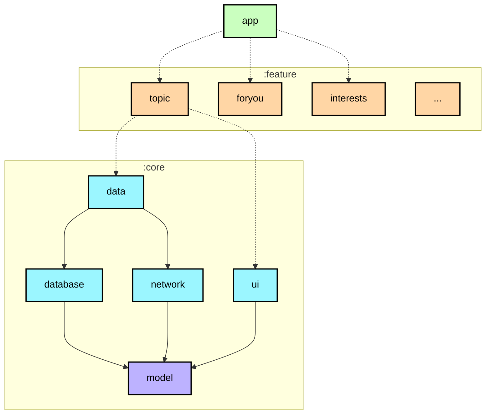
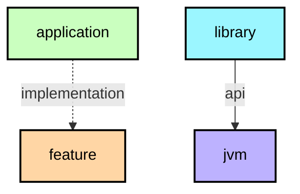

# 模块化学习之旅

在此学习之旅中，你将了解 nowtest 应用中用于创建模块的模块化策略。有关模块化的理论，请查阅[官方指南](https://developer.android.com/topic/modularization)。

**重要提示：** 每个模块在其 README 中都有一个依赖关系图（[示例：app 模块](https://github.com/weiyuhl/nowinandroidtest/tree/main/app)），这有助于理解项目的整体结构。

## 模块类型

📋 图例

**提示**：模块图（如上所示）在模块化规划时可用于可视化模块之间的依赖关系。

nowtest 应用包含以下类型的模块：

### `app` 模块
包含应用级别和脚手架类，这些类将代码库的其余部分绑定在一起，例如 `MainActivity`、`NtApp` 和应用级控制导航。一个很好的例子是通过 `NtNavHost` 进行导航设置，以及通过 `TopLevelDestination` 进行底部导航栏设置。`app` 模块依赖所有 `feature` 模块和所需的 `core` 模块。

### Feature 模块
这些是功能特定的模块，在应用中处理单一职责。例如，`ForYou` 功能处理"为你推荐"页面的所有内容和 UI 状态。Feature 模块本身不是 Gradle 模块，它们被分为两个子模块：

* `api` - 包含导航键
* `impl` - 包含其他所有内容

这种方法允许功能通过使用目标功能的导航键导航到其他功能。一个功能的 `api` 和 `impl` 模块可以被任何应用使用，包括测试或其他风味应用。如果一个类只需要被一个功能模块使用，它应该保留在该模块中。否则，应该将其放入合适的 `core` 模块中。

一个功能的 `api` 模块不应依赖另一个功能的 `api` 或 `impl` 模块。一个功能的 `impl` 只应依赖另一个功能的 `api` 模块。两个子模块只应依赖它们所需的 `core` 模块。

### Core 模块
这些是通用库模块，包含辅助代码和需要在应用其他模块之间共享的特定依赖。这些模块可以依赖其他 core 模块，但不应依赖 feature 或 app 模块。

### 杂项模块
例如 `sync`、`benchmark` 和 `test` 模块，以及 `app-nt-catalog` — 一个用于快速展示我们设计系统的目录应用。

## 示例

<table>
  <tr>
   <td><strong>名称</strong>
   </td>
   <td><strong>职责</strong>
   </td>
   <td><strong>关键类和示例</strong>
   </td>
  </tr>
  <tr>
   <td><code>app</code>
   </td>
   <td>将应用正常运行所需的一切整合在一起。包括 UI 脚手架和导航。
   </td>
   <td><code>NtApp, MainActivity</code> 
   通过 <code>NtNavHost, NtAppState, TopLevelDestination</code> 实现应用级控制导航
   </td>
  </tr>
  <tr>
   <td><code>feature:1:api,</code> 
   <code>feature:2:api</code> 
   ...
   </td>
   <td>其他功能可用于导航到此功能的导航键和函数。  
   例如：<code>:topic:api</code> 模块暴露一个 <code>Navigator.navigateToTopic</code> 函数，当用户点击主题时，<code>:interests:impl</code> 模块使用该函数从 <code>InterestsScreen</code> 导航到 <code>TopicScreen</code>。
   </td>
   <td><code>TopicNavKey</code>
   </td>
  </tr>
  <tr>
   <td><code>feature:1:impl,</code> 
   <code>feature:2:impl</code> 
   ...
   </td>
   <td>与特定功能或用户旅程相关的功能。通常包含 UI 组件和从其他模块读取数据的 ViewModel。 
   示例包括： 
   <ul>
      <li><a href="https://github.com/weiyuhl/nowinandroidtest/tree/main/feature/topic/impl"><code>feature:topic:impl</code></a> 在 TopicScreen 上显示关于主题的信息。</li>
      <li><a href="https://github.com/weiyuhl/nowinandroidtest/tree/main/feature/foryou/impl"><code>feature:foryou:impl</code></a> 在"为你推荐"页面上显示用户的新闻 Feed 和首次运行时的引导流程。</li>
      </ul>
   </td>
   <td><code>TopicScreen</code> 
   <code>TopicViewModel</code>
   </td>
  </tr>
  <tr>
   <td><code>core:data</code>
   </td>
   <td>从多个数据源获取应用数据，供不同功能共享。
   </td>
   <td><code>TopicsRepository</code> 
   </td>
  </tr>
  <tr>
   <td><code>core:designsystem</code>
   </td>
   <td>设计系统，包括核心 UI 组件（其中许多是自定义的 Material 3 组件）、应用主题和图标。可以通过运行 <code>app-nt-catalog</code> 运行配置来查看设计系统。
   </td>
   <td>
   <code>NtIcons</code>    <code>NtButton</code>    <code>NtTheme</code>
   </td>
  </tr>
  <tr>
   <td><code>core:ui</code>
   </td>
   <td>功能模块使用的复合 UI 组件和资源，例如新闻 Feed。与 <code>designsystem</code> 模块不同，它依赖数据层，因为它渲染模型，如新闻资源。
   </td>
   <td> <code>NewsFeed</code> <code>NewsResourceCardExpanded</code>
   </td>
  </tr>
  <tr>
   <td><code>core:common</code>
   </td>
   <td>模块之间共享的通用类。
   </td>
   <td><code>NtDispatchers</code> 
   <code>Result</code>
   </td>
  </tr>
  <tr>
   <td><code>core:network</code>
   </td>
   <td>进行网络请求并处理来自远程数据源的响应。
   </td>
   <td><code>RetrofitNtNetworkApi</code>
   </td>
  </tr>
  <tr>
   <td><code>core:testing</code>
   </td>
   <td>测试依赖、仓库和工具类。
   </td>
   <td><code>NtTestRunner</code> 
   <code>TestDispatcherRule</code>
   </td>
  </tr>
  <tr>
   <td><code>core:datastore</code>
   </td>
   <td>使用 DataStore 存储持久化数据。
   </td>
   <td><code>NtPreferences</code> 
   <code>UserPreferencesSerializer</code>
   </td>
  </tr>
  <tr>
   <td><code>core:database</code>
   </td>
   <td>使用 Room 进行本地数据库存储。
   </td>
   <td><code>NtDatabase</code> 
   <code>DatabaseMigrations</code> 
   <code>Dao</code> 类
   </td>
  </tr>
  <tr>
   <td><code>core:model</code>
   </td>
   <td>在整个应用中使用的模型类。
   </td>
   <td><code>Topic</code> 
   <code>Episode</code> 
   <code>NewsResource</code>
   </td>
  </tr>
</table>

## 依赖关系图
每个模块都有自己的 `README.md` 文件，其中包含模块图（例如 [`:app` 模块图](../app/README.md#模块依赖图)）。当模块依赖关系发生变化时，模块图由 [Build.yaml](../.github/workflows/Build.yaml) 工作流自动更新。你也可以通过运行 `graphUpdate` 任务手动更新图表。

## 进一步考虑

我们的模块化方法是考虑到"nowtest"项目路线图、即将到来的工作和新功能而定义的。此外，我们这次的目标是在对一个相对较小的应用过度模块化与利用这个机会展示适合更大代码库（更接近生产环境中的真实应用）的模块化模式之间找到合适的平衡。

这种方法与 Android 社区进行了讨论，并根据他们的反馈进行了演变。然而，对于模块化来说，没有一个绝对正确的答案。最终，模块化一个应用有许多方式和途径，很少有方法能适合所有目的、代码库和团队偏好。这就是为什么提前规划并考虑所有目标、你要解决的问题、未来的工作以及预测潜在的障碍，都是定义最适合你自己独特环境的结构的关键步骤。开发者可以通过头脑风暴会议绘制模块和依赖关系图来更好地可视化和规划。

我们的方法就是这样一个示例——我们不期望它是一个适用于所有情况的不可变结构，事实上，它可能在未来演变和变化。这是一个通用指南，我们发现它最适合我们的项目，并将其作为一个示例提供，你可以在此基础上进一步修改、扩展和构建。一种方式是进一步增加代码库的粒度。粒度是指代码库由模块组成的程度。如果你的数据层很小，将其保留在单个模块中是没问题的。但一旦仓库和数据源的数量开始增长，可能值得考虑将它们拆分为单独的模块。

我们也始终欢迎你提出建设性的反馈——从社区中学习并交流想法是改进我们指导的关键要素之一。
